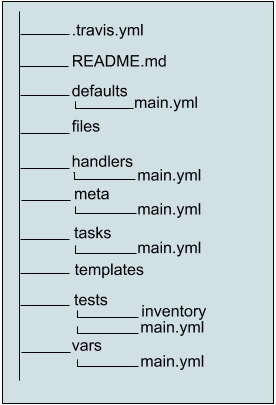

================
Create a Role
================

.. index::
    pair: galaxy; create a role
    pair: role; create

**What you will learn**: 

How to create and execute a basic Ansible role and some best practices to follow as you create your own roles.

For this example, you will create the universal Hello World app in the form of a role called ``role-hello-world``.

Requirements
****************
.. index::
    pair: galaxy; requirements
    single: requirements

- `GitHub`_ account
- `git`_ installed (you will be guided through the command line interface)
- `Ansible`_ (version 2.0) or greater installed
- `cowsay`_ installed (optional; install if you like cows)

.. _GitHub: https://github.com/
.. _git: https://git-scm.com/
.. _Ansible: http://docs.ansible.com/ansible/intro_installation.html
.. _cowsay: https://gist.github.com/dakull/6615458

Create a GitHub Repository
****************************

.. index::
    pair: galaxy; create a github repo
    pair: github repo; create

Before getting into the details of creating a role, first create a new GitHub repository for this role. If you are unfamiliar with creating a repository on GitHub, see `Create a Repo`_. Name the repository ``role-hello-world``. Leave the *Initialize repository with a README* option unchecked and leave the ``.gitignore`` option empty (you will add your own later). And, if this is a public repo, choose a license.

.. _Create a Repo: https://help.github.com/articles/create-a-repo/

Next, create a local copy of the new repository. Replace the URL used in the example below with the URL for your repository:

::

    $ git clone https://username@github.com/username/role-hello-world.git

The above creates a folder named ``role-hello-world`` containing some git configuration items and a license file, if you added one. 

Create Role Scaffolding
************************

.. index::
    pair: galaxy; create role scaffolding
    pair: role; create scaffolding
    single: scaffolding (create for role)

Using the ``ansible-galaxy`` command that comes bundled with Ansible, you will execute the ``init`` command to add some initial scaffolding to your ``role-hello-world`` folder. You will also need to include the ``--force`` option, telling Ansible to ignore the fact that ``role-hello-world`` already exists. From the same directory where you ran the command to create the local copy of the repository, run the following command:

::

    $ ansible-galaxy init role-hello-world --force

Ansible Galaxy added the following to your ``role-hello-world`` folder:

|role scaffolding|

Here’s a quick summary for each component of an Ansible role:

================== =================================================================================================================
Role                Summary
================== =================================================================================================================
.travis.yml          When you are ready to test your role, this file can be used to start integration testing with `Travis`_-CI.
README.md           Documentation that helps others use your role.
defaults/main.yml   Defaults for role variables.
files               Files needed by your role that cannot be represented in a template. 
handlers/main.yml   Define handlers that respond to task notification.
meta/main.yml       Add a list of any roles this role depends on, and provide metadata when sharing the role on Galaxy.
tasks/main.yml      The actual work the role will perform.
templates           jinja2 templates used by the role
tests               Files referenced in ``.travis.yml`` to perform a simple test against the role.
var/main.yml        Define additional variables with higher priority than ``defaults/main.yml``.
================== =================================================================================================================

For the purpose of this example, this documentation focuses on the basics needed to get your role functioning.

.. _Travis: https://travis-ci.org/

Add Tasks
***********

.. index::
    pair: galaxy; add tasks
    single: tasks, adding

Begin by adding a task to ``tasks/main.yml``. This is the Ansible playbook containing the actual work or tasks the role will perform. Open ``tasks/main.yml`` and add the following:

::

    - name: Say Hello
      debug: var=hello_world_message

In this task, you will use the debug module to display the contents of variable ``hello_world_message`` to stdout (standard output).

Define Variables
******************

.. index::
    pair: galaxy; define variables
    single: variable definitions

Now you must set the value of the variable ``hello_world_message``. Do this in ``defaults/main.yml``, where all the variables used in the role are listed, and provide each with a default value. Add the following line to ``defaults/main.yml``:

::

    hello_world_message: Hi!

Create a Playbook
********************

.. index::
    pair: galaxy; create a playbook
    single: playbook, creation

To run your role you will need a playbook. In the parent folder to ``role-hello-world`` create a new file called ``hello.yml``. This will be your playbook. Add the following lines to ``hello.yml``:

::

    - hosts: all
      connection: local
      roles:
        - role-hello-world

Create an Inventory File
**************************

.. index::
    pair: galaxy; create an inventory file
    single: inventory file, creation

Ansible must know which hosts to run the playbook on, which is defined by an inventory file. An inventory file is simply a text file containing a list of hosts. Create a new file called inventory in the same folder as ``hello.yml``. Add the following line to inventory, telling Ansible to run locally on your computer:

::

    localhost

Run the Playbook
******************

.. index::
    pair: galaxy; run the playbook
    single: inventory file, creation

You are now ready to run your playbook! To start the playbook, use the ``ansible-playbook`` command, specifying the inventory file and which playbook to run. Type the following command from the same folder containing ``hello.yml``:

::

    $ ansible-playbook -i inventory hello.yml

If you have cowsay installed, the output from running ``hello.yml`` will look like the following:

::

    ______
    < PLAY >
     ------
            \   ^__^
             \  (oo)\_______
                (__)\       )\/\
                    ||----w |
                    ||     ||

     ______________
    < TASK [setup] >
     --------------
            \   ^__^
             \  (oo)\_______
                (__)\       )\/\
                    ||----w |
                    ||     ||

    ok: [localhost]
     _____________________________________
    < TASK [role-hello-world : Say Hello] >
     -------------------------------------
            \   ^__^
             \  (oo)\_______
                (__)\       )\/\
                    ||----w |
                    ||     ||

    ok: [localhost] => {
        "hello_world_message": "Hi!"
    }
     ____________
    < PLAY RECAP >
     ------------
            \   ^__^
             \  (oo)\_______
                (__)\       )\/\
                    ||----w |
                    ||     ||

    localhost                  : ok=2    changed=0    unreachable=0    failed=0

What Just Happened?
**********************

.. index::
    pair: galaxy; understanding the stdout
    pair: stdout; playbook behind-the-scenes

The above stdout provides a step-by-step guide to the execution of your playbook. Ansible started your play by running the setup task on your host, localhost. Each time a play starts Ansible performs a setup task on all hosts included in the play where it connects to each host and gathers some facts that may be needed by subsequent tasks in the play. In this case the setup task completed with an OK status for localhost.

Next ansible moved to the roles task in your play, as indicated by ``TASK[role-hello-world:Say Hello]``. This tells you it is running your role starting with the task you named "Say Hello". This is followed by the results of the task executed on localhost, as indicated by ``OK: [localhost] => `` and the output from the debug module showing the default value you provided for the ``hello_world_message variable``. 
And finally, the output provides a recap for the play letting you know what the outcome was for each host. In this case "localhost" finished with an OK status. you did not modify anything on "localhost", so changed is 0 (zero). As expected, Ansible was able to communicate with "localhost" and none of your tasks failed.

How Do you Change the Message?
*******************************

.. index::
    pair: galaxy; changing the variable message
    single: variable message, changing

This simple role displays the value of the ``hello_world_message`` variable. The default value is set to "Hi!". If you want it to be something else, you can provide a value in your playbook. Make a change to ``hello.yml`` to see how it works. Open ``hello.yml`` and change the line in the roles list for ``role-hello-world`` to the following:

::

    roles:
      - { role: role-hello-world, hello_world_message: Hello Everybody! }

Instead of just providing the name of your role, you are now providing the name of the role plus a value for ``hello_world_message``.

Running your updated playbook produces the following output, showing the new value assigned to ``hello_world_message``:

::

    $ ansible-playbook -i inventory hello.yml
     ______
    < PLAY >
     ------
            \   ^__^
             \  (oo)\_______
                (__)\       )\/\
                    ||----w |
                    ||     ||

     ______________
    < TASK [setup] >
     --------------
            \   ^__^
             \  (oo)\_______
                (__)\       )\/\
                    ||----w |
                    ||     ||

    ok: [localhost]
     _____________________________________
    < TASK [role-hello-world : Say Hello] >
     -------------------------------------
            \   ^__^
             \  (oo)\_______
                (__)\       )\/\
                    ||----w |
                    ||     ||

    ok: [localhost] => {
        "hello_world_message": "Hello Everybody!"
    }
     ____________
    < PLAY RECAP >
     ------------
            \   ^__^
             \  (oo)\_______
                (__)\       )\/\
                    ||----w |
                    ||     ||

    localhost                  : ok=2    changed=0    unreachable=0    failed=0

In this way role variables can be thought of as parameters. If ``role-hello-world`` was a function in your favorite programming language, you just called that function with a parameter of ‘Hello Everybody!’ and changed the execution result. And that is the real power of an Ansible role. A role allows you to turn a set of tasks into a reusable unit of work, just like an object or function in any programming language.

Best Practices
*****************

.. index::
    pair: galaxy; best practices

This example role is pretty simple, but roles are pretty simple, too. A role is nothing more than a set of tasks contained in ``tasks/main.yml`` that can be used over and over again. The tasks can be simple, like this example, or extremely complex. When used correctly, a role contains everything needed to execute the tasks, including a default configuration, documentation, templates, files, and handlers. 

To insure your future roles meet this standard, here are some guidelines to follow:

- Provide clear documentation in a ``README.md`` file. For this exercise you did not update ``README.md``, but take a look at the template provided by ``ansible-galaxy``. ``README.md`` is composed using markdown.
- A role can depend on other roles executing before it. Include any dependencies in ``meta/main.yml``. Learn more about dependencies here FIXME*NEEDLINKTODOCS*FIXME
-  Prefix variable names with the role name, just like you did with ``hello_world_message``.
- In ``defaults/main.yml`` provide a default value for each variable.
- Test your role, just as you did here.
- Provide any templates and files needed by the role, even if they are just samples, so that your role works out-of-the-box.

